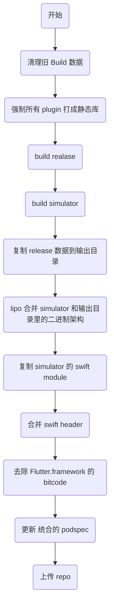

  
Flutter 升 2.0 后 iOS module 升级打包流程记录

<!-- more -->

## 背景

项目之前引入了 flutter 来开发其中一个模块，引用方式是把 release 环境下生成的 App.framework 和 Flutter.framework 及所有 plugin 的源码压缩上传，在项目 `pod install` 时手动下载并以 dev pod 的方式引用。这样的引用导致主项目不关注的 Flutter 内容被以 dev 方式引用，且需要自己手动管理项目里下载的 Flutter 内容。

近期 flutter 升级了 2.0 ， release 包不再支持 x86 架构，导致在模拟器运行时编译报错。需要对打包和引入方式进行升级。

## 新打包流程



### 新包使用方法

打包后修改主项目 Podfile 内的 "pod 'FlutterLib', 'x.x.x'" 的版本号即可。

## 升级过程


### 修改 build 方式

之前的打包过程中，release 包走的是 "./flutterw build ios --release --no-codesign" ，是官方推荐的做法。但 debug 包却是单独只 build bundle ，即只 build 了资源文件， Flutter.framework 和 App.framework 都是从 flutter 目录里拷贝的，不是现 build 的。

这个流程不合理，统一改为了用"./flutterw build ios --{mode} --no-codesign" 的方式 build release 和 simulator 两份。

### 收集 flutter 和 plugin 的 pod

开发中引用的一些 plugin 在 iOS 端有相应的 pod ，这部分在打包的时候也需要带进去。

之前的做法是遍历所有的 plugin ，找到 iOS 端的源码，然后全部拷贝到一起，再以 development pod 的方式引用。

因为不期望使用 development pod ，如果用 pod 的方式引入，就需要往 repo 里传一份，并找个仓库存放对应的源码，这样做需要加不少逻辑，同时如果 plugin 有变动，也需要改动主项目的 podfile ，不是一种好做法。

看 build 的结果发现所有 plugin 的 pod 和 App.framework ， Flutter.framework 都在一起，且也被打成了二进制文件，于是决定直接用二进制的方式引用。

flutter build 默认打出来的 plugin pod 是 .a ，不方便直接引用，在 iOS/Podfile 里首行加上 use_framework! 后就能打成 .framework 了。

然后建了 1 个文件夹把 build 后所有的 plugin pod ，App.framework 和 Flutter.framework 都拷贝了过去。

拷贝的时候不能把 build 目录里的文件全部拷贝，因为除了 Runner 本身的 framework 外，引用的一些公共库，如 Mantle 等也在里面，需要从 .flutter_plugins 文件读取 plugins 的列表，再有针对性的复制，同时 FlutterPluginRegistrant 需要单独处理，它不在 .flutter_plugins 里面。

### 生成新的 pod

新建了一个 FlutterLib.podspec ，通过  `vendored_frameworks` 引入了所有的 framework ，主项目引入的时候只需要引入 FlutterLib 即可，不需要再关注 flutter 其他内容变动。

FlutterLib 引入的 framework 目前是都打成了 1 个 zip ，上传到私有仓库。

### 主项目引入

主项目引入 TutorFlutterLib 时，编译报错，Reason: image not found 。原因是因为 Flutter 打包生成的是动态库，导致引用的一些公共库在链接的时候找不到。

起初想通过修改 iOS/Runner 的设置来令所有的 pod 都打成静态库，但是因为 App.framework 和 Flutter.framework 必须打成动态库，一改就会导致打包失败，只能无奈放弃。

最后用了比较 hack 的方法，读取 .flutter_plugins 并遍历所有 plugin pod 的 podspec ，强制加上了 `s.static_framework = true` 来保证所有 plugin pod 都是静态库，避免因为依赖公共库导致的编译报错。

### 兼容 simulator x86 架构

先是同时 build 了 release 和 simulator 两套文件，然后先将 release 的结果放到输出目录里去，再通过 lipo 将 simulator 的 framework 内的二进制文件合并到输出结果里去。

本以为这样应该就可以了，结果编译报错，提示找不到 x86 的构架。起初以为是 simulator 打包或者合并二进制的过程出问题了，排查了一阵子后发现这两个都没有问题。

问题出在打包的时候， release 和 simulator 两种模式除了二进制文件外，部分 pod 在 .framework/ambassador.swiftmodule（不是所有的 pod 这里面都有内容） 里也有按架构区分的文件，这部分也要复制过去。

同样有问题的还有 Swift.h 文件，但，而是需要修改 `Headers/{pod_name}-Swift.h` ，将 release 和 simulator 的 Swift.h 合并成 1 个，结构如下：

``` objc
#if TARGET_OS_SIMULATOR
{simulator 代码}
#else
{release 代码}
#endif
```

### 去除 bitcode

 Flutter 2.0 开始在生成的 Flutter.framework 里会包含 bitcode ，导致体积从几十 M 增加到了几百 M，不便于 pod 的上传和下载。且我们项目对 bitcode 没有需求，故去除了 bitcode 以精简包体积。命令为 `xcrun bitcode_strip -r {binary_path} -o {output_path}`

bitcode 的相关内容可见 [深入了解iOS中的Bitcode功能](https://juejin.cn/post/6968272595686785031)