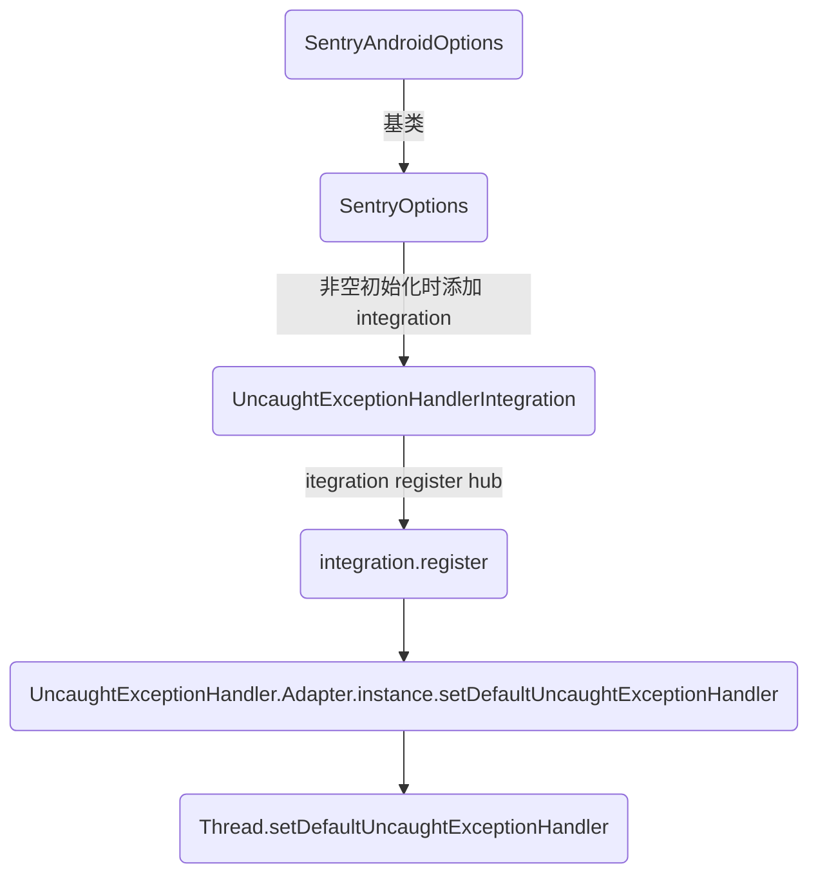

为 module 形式接入的 Flutter 接入 Sentry ，且与主项目的 Sentry 区分上报到不同项目。

<!-- more -->

## 背景

项目以 module 形式接入了 Flutter ，期望为 Flutter 接入 Sentry 来捕获异常，监控线上状态。但主项目里也接入了 Sentry ，期望主项目和 Flutter 上报到不同位置。

## Plugin 选择

Sentry 在 Flutter 里有2个官方库 `sentry` 和 `sentry_flutter` 。

其中 `sentry` 是纯 dart 实现，上报不经过 Native，可以完美实现和主项目的 Sentry 区分上报，但是上报的信息里完全没有设备信息，如手机型号、系统版本等数据。

`sentry_flutter` 则包含了 Native 的实现，上报最后会转接 Native 去上报，这种上报能带上设备信息，但是因为 Sentry 的 Native 代码是单例，直接引用 `sentry_flutter` 会导致 Flutter 和 Native 的 Sentry 配置相互覆盖（具体覆盖顺序取决于初始化顺序），最后上报到同一个项目中去。

因为期望在上报的时候能带上设备信息，所以最后选择了使用 `sentry_flutter` ，同时为了实现区分上报功能，故 fork 了 `sentry_flutter` 的源码，修改

实现了分开上报的功能。

## 实现方案

### 手动创建 SentryHub

Sentry 的上报是基于 SentryHub 来进行的，要分开上报就需要创建只属于 Flutter 的 SentryHub。

这一步基本就是照着两端的初始化流程抄了一遍，创建单独的 SentryOptions 和 SentryHub ，由 Plugin 自行维护，后续上报和关闭均用该 hub 进行。

iOS 创建流程参考 `SentrySDK.startWithConfigureOptions()` ，Android 创建流程参考 `SentryAndroid.init()` 。

但创建后实际上报时发现，虽然是上报到独立的 dsn ，也没有影响到 Native 的上报，但是和 Native 相比缺少很多 context 信息，如设备型号和系统信息等。刚发现不对时以为是我创建流程写得不对，又对比了一遍创建流程，发现没有什么区别，于是开始进一步查看 context 相关的源码，想办法为 Flutter 的 hub 在上报时附加相关 context 信息。因为两端实现差距较大，后续流程分开描述。

> 初始化时有一点需要注意的是，不能够参考 Native 里去调 integration 的 register 。在 Android 端会影响到 Native Crash 的捕获。具体详见下文。

### iOS 附加 Context

iOS 的 context 是 options 里的 **integrations** 添加上去的，在初始化结束后就往 hub.scope 添加好了。在创建 Flutter 的 hub 时，也对 options 里的 integrations 执行了相应的 install 操作，但执行后没有并没有为 scope 赋值，看了各个 integration 的源码，发现内部均是直接指向了 Native 的单例 hub ，在外面再怎么调用 install 都是没有用的。


并且因为 currentHub 和 scope 均为 private ，只能通过 `SentrySDK.configureScope()` 间接访问，最后从 SentrySDK 里取已经配置好的单例 scope 复制一份给自建 hub 。

``` sw
var flutterScope: Scope?
SentrySDK.configureScope { scope in
    flutterScope = Scope(scope: scope)
}
let hub = SentryHub(client: client, andScope: flutterScope)
```

至此 iOS 上报就结束了。

### Android 附加 context

起初以为 Android 和 iOS 附加的方式是一样的，复制一份 scope 就行，且因为 Android 里 scope 和 scope.context 不再是 private ，写起复制来说更容易。但是写完一测，发现还是没有，于是又翻起了 Android 侧的源码，发现两边赋值逻辑不一样。

Android 的 options 里多了 1 个 **eventProcessors** 属性，context 相关的内容是存放在这里，且因为其中1个 `DefaultAndroidEventProcessor` 和创建它的 `AndroidOptionsInitializer.init()` 均是私有类，在初始化内部还会去读取 xml 覆盖 options 的设置，最后手动复制了 1 份 eventProcessors 。

``` kotlin
val nativeOptions = HubAdapter.getInstance().options
val flutterOptions = SentryAndroidOptions()
flutterOptions.enableUncaughtExceptionHandler = false
for (processor in nativeOptions.eventProcessors) {
    flutterOptions.addEventProcessor(processor)
}
configOptions(args, flutterOptions)
val hub = Hub(flutterOptions)
```

复制之后，用 `hub.captureMessage()` 测试上报有 context 了，但在上报异常的时候使用 iOS 一样的 `hub.captureEnvelope()` 却又没有 context 了，于是开始追溯这两种上报的区别。发现 message 最后也是转为了 envelope ， captureMessage() 内部上报数据有一条转换关系 message → event → envelope ，其中 context 是在 event → envelope 的过程中遍历 eventProcessors 进行赋值的，详见 `SentryClient.processEvent()` 方法。 flutter 上报时因为传到 native 层时就是 envelope 了，如果直接用 hub.captureEnvelope() 上报就会跳过附加 context 的过程。

最后是通过将 envelope.items 逆向转换为 event ，再通过 `hub.captureEvent()` 来迂回上报的方式来附加 context 。

``` kotlin
val gsonSerializer = hub.options.serializer
gsonSerializer.deserializeEnvelope(event.byteInputStream())?.let { envelope ->
    for (item in envelope.items) {
        val event = item.getEvent(gsonSerializer) ?: continue
        hub.captureEvent(event)
    }
}
```

如果有一些 Native 添加的 context 需要同步给 Flutter 的上报的话，可以通过如下代码实现：

``` kotlin
HubAdapter.getInstance().configureScope { native ->
    hub.configureScope { flutter ->
        for ((key, value) in native.contexts) {
          flutter.setContexts(key, value)
        }
    }
}
```

### 不能调 integration 的 register

在上一步，如果仿照 Native 的初始化过程，也调了 integration 的 `register` 方法，会导致 Android 的 Crash 无法捕获，但不影响主动调用 Native Sentry 的上报。

要了解原因，首先要了解 Android Crash 的捕获流程。一切都是基于 `Thread.setDefaultUncaughtExceptionHandler()` 。



异常的原因是因为 `Thread.setDefaultUncaughtExceptionHandler()` 和 `UncaughtExceptionHandler.Adapter.getInstance()` 均是单例。而 Native 的 Options 先于 Flutter 的 Options 创建。

Flutter 的 Options 创建并调用 integration 注册时，覆盖了 Native 的设置，导致 Crash 被 Flutter 的 Options 捕获了。

iOS 不影响是因为它的 integration 注册和调用时强制指向了 SentrySDK.currentHub 的单例，重新调用也没事。
